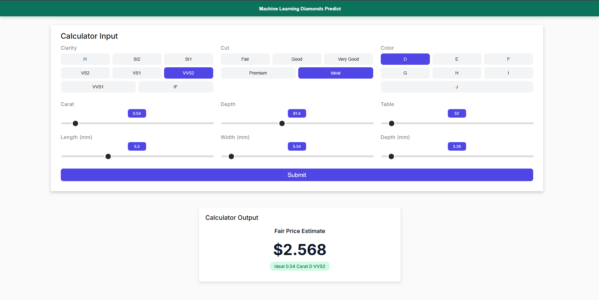

# 💎 Diamond Price Prediction Web Application

**


**

This project is a **machine learning–based web application** that predicts diamond prices based on their physical and qualitative features (carat, cut, color, clarity, depth, table, x, y, z).
It demonstrates an end-to-end machine learning workflow — including data preprocessing, feature scaling, model training, evaluation, and deployment through a web interface.

---

## 🗂️ Dataset

The dataset used in this project comes from the **Kaggle Diamonds Dataset**.
It contains over **53,940 diamond records** with the following attributes:

| Feature   | Description                                                  |
|-----------| ------------------------------------------------------------ |
| carat     | Weight of the diamond                                        |
| cut       | Quality of the cut (Fair, Good, Very Good, Premium, Ideal)   |
| color     | Diamond color grade (D–J)                                    |
| clarity   | Clarity level (IF–I3)                                        |
| depth     | Total depth percentage                                       |
| table     | Width of the top of the diamond relative to its widest point |
| x         | Length (mm)                                                  |
| y         | Width (mm)                                                   |
| z         | Depth (mm)                                                   |
| **price** | Target variable (in USD)                                     |

---

## 🧠 Project Workflow

### 1. **Data Cleaning**

* Removed invalid records with zero values in `x`, `y`, and `z`.
* Filtered out unrealistic values in `depth` and `table` columns.
* Handled outliers to improve model performance.

### 2. **Data Preprocessing**

* **Label Encoding** was applied to categorical columns (`cut`, `color`, `clarity`).
* **Feature Scaling** was performed using `StandardScaler` to normalize the data.

### 3. **Model Training**

* Model used: **Support Vector Regression (SVR)**
* Hyperparameters: `C=1000`, `gamma=0.1`, `kernel='rbf'`
* Train/Test split: **75% / 25%**
* Evaluation Metric: **R² Score**

📈 **Model Performance:**
**R² Score = 0.9455**
This indicates a strong correlation between predicted and actual diamond prices.

### 4. **Model Saving**

After training, the model, encoders, and scaler were saved in a single pickle file:

```python
with open("30-diamond_model.pkl", "wb") as f:
    pickle.dump({"model": svr, "encoders": encoders, "scaler": scaler}, f)
```

---

## 🌐 Web Application (FastAPI)

The trained model is deployed using **FastAPI**, providing a user-friendly web interface.
Users can input diamond characteristics and instantly receive a price prediction.

### Main Files:

| File                    | Description                     |
| ----------------------- | ------------------------------- |
| `app.py`                | FastAPI backend for prediction  |
| `templates/index.html`  | Web interface  |
| `30-diamond_model.pkl`  | Trained model file              |
| `30-testdatascaled.csv` | Scaled test dataset             |

---

## 🚀 How to Run the Project

1. **Clone the repository**

   ```bash
   git clone https://github.com/muhammetcubukluoz/diamond-price-prediction.git
   cd diamond-price-prediction
   ```

2. **Install dependencies**

   ```bash
   pip install -r requirements.txt
   ```

   or manually:

   ```bash
   pip install fastapi uvicorn scikit-learn pandas numpy matplotlib seaborn jinja2
   ```

3. **Run the FastAPI app**

   ```bash
   uvicorn app:app --reload
   ```

4. **Open your browser and visit**

   ```
   http://127.0.0.1:8000
   ```

---

## 🧩 Technologies Used

| Technology         | Purpose                                     |
|--------------------| ------------------------------------------- |
| **Python 3.x**     | Core programming language                   |
| **Pandas & NumPy** | Data processing and manipulation            |
| **Scikit-learn**   | Machine learning modeling and preprocessing |
| **FastAPI**        | Web framework for API development           |
| **HTML**             | HTML templating for frontend                |
| **Pickle**         | Model serialization and persistence         |

---

## 📁 Project Structure

```
Diamond_ML_project/
│
├── .venv/                  # Virtual environment
├── templates/              # Folder containing model and data files
│   ├── 30-diamond_model.pkl
│   └── 30-testdatascaled.csv
│
├── app.py                  # Main Flask application
├── modelTests.py           # Model testing script
├── savingModels.ipynb      # Jupyter notebook used for training and saving models
├── requirements.txt        # Project dependencies
└── README.md               # Project documentation
```

## 💰 Example Prediction Flow

1. User enters the following diamond details:
   `Carat: 0.54, Cut: Ideal, Color: D, Clarity: VVS2, Depth: 61.4, Table: 52, x: 5.3, y: 5.34, z: 3.26`

2. The model scales and encodes the input data.

3. Prediction result:
   💎 **Predicted Price: $5,120**

---

## 🖼️ App Screenshot

> 

---


